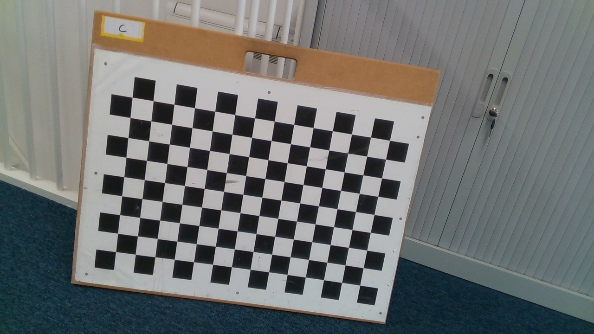

<div align="center">
<h1 align="center">
Impact-Aware Object Tracking: Exploiting Environment and Object Priors to Robustify Dynamic 6D Pose Estimation
</h1>
<h3>
<a href="https://www.maartenjongeneel.nl/">Maarten Jongeneel</a>,
<a href="https://www.linkedin.com/in/sander-dingemans/">Sander Dingemans</a>,
<a href="http://users.isr.ist.utl.pt/~alex/pmwiki/index.php">Alexandre Bernardino</a>,
<a href="https://www.tue.nl/en/research/researchers/nathan-van-de-wouw/">Nathan van de Wouw</a>,
<a href="https://www.tue.nl/en/research/researchers/alessandro-saccon/">Alessandro Saccon</a>
<br>
<br>
Transactions on Robotics, 2024
<br>
<br>
<a href="/">[Published paper on IEEE]</a>
<br>
<br>
<a href="/">[Published Paper on HAL]</a>
<br>
<br>
</h3>
</div>

If you are using this paper as reference, please refer to it as
```bibtex
@inproceedings{Jongeneel2024_Tracking,
    author = {M J Jongeneel and S Dingemans and A Bernardino and N van de Wouw and A Saccon},
    title = {{Impact-Aware Object Tracking: Exploiting Environment and Object Priors to Robustify Dynamic 6D Pose Estimation}},
    note = {{Submitted to: IEEE Transactions on Robotics (T-RO)}},
    year = {2024},
    month = {Jul.}
}
```

Introduction
============

6D Object tracking is an essential technique in computer vision and has many applications in robotics, both for locomotion and manipulation. In this study, the focus lies on tracking objects impacting the environment. We show that state-of-the-art methods lose track of objects in this context and we investigate a possible way to mitigate this problem by adding prior information regarding the object, the surface where collision is expected to occur, and their interaction. In particular, we include the effects of impacts and friction in a motion model. For illustration purposes and application relevance, we focus on the case of a box impacting a surface, which is encountered, e.g., in robot tossing in logistics applications. As common to avoid rotations parametrization singularity, we consider the box rotation to evolve on the set of rotation matrices SO(3) and, correspondingly, the box state to evolve on a Lie group. Our solution to the tracking problem takes the form of a geometric unscented particle filter that incorporates an impact-aware motion model. The observations are taken from a single RGB camera and make use of the known 3D model of the object and color characteristics to predict its appearance in the 2D image. We quantitatively evaluate the effectiveness of our proposed methods on experimental data obtained for multiple objects, against baseline approaches.

<br>
<br>
<br>

Table of content
================
- [Overview](#overview)
- [Cloning and startup instructions](#cloning-and-startup-instructions)
- [Prerequisites](#prerequisites)
    - [Data](##data)
    - [Camera Calibration](#camera-calibration)
    - [Object Detection](#object-detection)
    - [Sensor sime synchronization](#aruco-detection-for-time-synchronization)
- [Usage of the scripts](#usage-of-the-scripts)
- [Contact](#contact)
- [References](#references)

<br>
<br>
<br>

# Overview
Here we will give a summary of the approach and main results

<br>
<br>
<br>

# Cloning and startup instructions
1. This repository is publicly available and can be cloned without additional rights. To make sure you include all submodules when cloning, execute these commands:
```cmd
git clone --recurse-submodules https://gitlab.tue.nl/robotics-lab-public/validation-of-impact-aware-object-tracking.git
```
2. The code in this repository uses data (images, videos) that are stored in the [impact-aware robotics database](https://impact-aware-robotics-database.tue.nl/). This data can be viewed and downloaded via:
https://doi.org/10.4121/21400011. Download the `.zip` file, unzip it, and place the 
```cmd
230127_Archive_013_ImpactAwareObjectTracking.h5
```
file in the [/Data](/Data) folder. 

3. Make sure in MATLAB you run al scripts from the root folder of this repo, and add all folders and subfolder to your path. You should be set to go now! 

<br>
<br>
<br>


# Prerequisites
The following subsections describe how different procedures are done. It is not needed to redo this to run any of the scripts. However, if you like to reproduce our results, you can follow the instructions in the subsections below, which give further detailed information.
## Camera calibration
### Intrinsics
The camera calibration is done using VISP (see [VISP website](https://visp-doc.inria.fr/doxygen/visp-daily/tutorial-calibration-intrinsic.html)). From a set of images, we obtain the intrinsic parameters of the camera using [the tuturial](https://visp-doc.inria.fr/doxygen/visp-daily/tutorial-calibration-intrinsic.html) and the images stored in the [intrinsics](/calibratecam/intrinsics/) folder of this repo (see also Figure 1 for an example). If you want to reproduce these results, please follow that tutorial.

<div align="center">
    <div style = "display: flex; align="center">
         
    </div>
    <p>Figure 1: One of the pictures used for intrinsic calibration.</p>
</div>


### Extrinsics
The camera is tracked using motion capture, where we assigned a frame to the camera casing. This frame (indicated by the letter G) does not coincide with the camera sensor frame (A) (see also Figure 2). To obtain this transformation, we perform an extrinsic calibration. Following the [VISP tutorial](https://visp-doc.inria.fr/doxygen/visp-daily/tutorial-calibration-extrinsic.html) and using the intrinics obtained in the previous step and the images in the [extrinsics](/calibratecam/extrinsics/) folder, we obtain the poses of the checkerboard w.r.t. the camera for each image. Since for each image, we also recorded the pose of the camera frame (G) w.r.t. a world frame using motion capture, we can solve an optimization problem to find the relative transformation between the camera casing frame (G) and the camera sensor frame (A). This optimization is based on the work of [[3](#references)] and [[4](#references)] and is incorporated in the script [calibratecam.m](/calibratecam/calibratecam.m) which can be run to reproduce the extrinsic calibration.

<div align="center">
    <div style = "display: flex; align="center">
         
    </div>
    <p>Figure 2: Overview of the extrinsic camera calibration.</p>
</div>

## Object Detection 
For training the model and performing object detection, we use the Single Shot MultiBox Detector (SSD) [[1](#references)] and we use the open available Tensorflow implementation pretrained on the COCO dataset [[2](#references)]. However, to allow detecting boxes, we need to train the model on annotated images of boxes. Therefore, we need to do the following steps:

- install conda (see https://docs.conda.io/en/latest/miniconda.html#linux-installers)
- Open a terminal and type 
```bash
conda create -n tf python=3.7
```
- then type 
```bash
conda activate tf
```
- then run
```bash
gedit ~/.bashrch
```
and add
```bash
export PYTHONPATH="${PYTHONPATH}:/path/to/git/root/detection/content/models/research/"
export PYTHONPATH="${PYTHONPATH}:/path/to/git/root/detection/content/models/research/slim"
```
and save the file.
- go back to the terminal and run
```bash
cd detection
python objectdetectionfinal.py
```

## Aruco detection for time synchronization
In order to synchronize OptiTrack Motion Capture data with the RGB data, every recording starts with the movement of an Aruco Tracker (a rigid body containing both Mocap markers and an Aruco marker) from which we can track the movement via OptiTrack and via an [OpenCV Aruco module](https://docs.opencv.org/4.x/d5/dae/tutorial_aruco_detection.html). The result of these tracked aruco markers for our videos is already incorporated in the dataset. However, if one is instested in reproducing the results, follow these steps:

1. The Aruco module can be used by installing OpenCV-contrib, an extension module of OpenCV. You can do this with the following command.
```cmd
pip install opencv-python
pip install opencv-contrib-python
```
You might also need to install 
```cmd
pip install Pillow
```
2. You can then perform the aruco detection via
```cmd
python arucoDetect.py
```
which outputs images with the detected aruco frames shown and a csv file containing the 3D position and orientation of the aruco markers with respect to the camera frame. Note that in the `arucoDetect.py` script, certain paths and camera settings are assumed that can be changed:
```python
# Camera matrix and distrotion parameters
cameraMatrix = np.array([[692.87286,0,357],
                [0,692.23956,269],
                [0,0,1]])
distCoeffs = np.array([0.0,0.0,0.0,0.0,0.0])

# Directories
img_dir = "./Images/Rec_20230309T153850Z/"
res_dir = "./Images/ArucoDetectImages/"
```

<br>
<br>
<br>

# Usage of the scripts

## Note
When running the scripts, in order to extract the video images from the data file, the saved binary video file is first written to the current folder as an .mp4 file, from which the images are extracted, after which this .mp4 file is deleted. In order to run the scripts, you must therefore allow write access to the current folder from your OS.

<br>
<br>
<br>

# Contact
In case you have questions or if you encountered an error, please contact us through the "Issues" functionality on GIT. 

<br>
<br>
<br>

# References
[1] Liu, W. et al. (2016). "SSD: Single Shot MultiBox Detector". In: Leibe, B., Matas, J., Sebe, N., Welling, M. (eds) Computer Vision – ECCV 2016. ECCV 2016. Lecture Notes in Computer Science(), vol 9905. Springer, Cham. https://doi.org/10.1007/978-3-319-46448-0_2 

[2] Lin, TY. et al. (2014). Microsoft COCO: Common Objects in Context. In: Fleet, D., Pajdla, T., Schiele, B., Tuytelaars, T. (eds) Computer Vision – ECCV 2014. ECCV 2014. Lecture Notes in Computer Science, vol 8693. Springer, Cham. https://doi.org/10.1007/978-3-319-10602-1_48 

[3] R. Y. Tsai and R. K. Lenz, "A new technique for fully autonomous and efficient 3D robotics hand/eye calibration", in IEEE Transactions on Robotics and Automation, vol. 5, no. 3, pp. 345-358, June 1989, https://doi.org/10.1109/70.34770.

[4] F. C. Park and B. J. Martin, "Robot sensor calibration: solving AX=XB on the Euclidean group," in IEEE Transactions on Robotics and Automation, vol. 10, no. 5, pp. 717-721, Oct. 1994, doi: https://doi.org/10.1109/70.326576.


